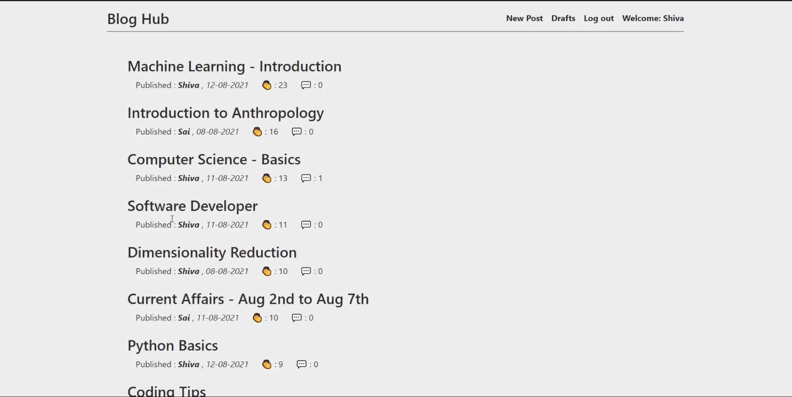

# Blog Hub

Blog hub is a dynamic web application that provides users to read and publish articles. It includes features like Medium-like editor for styling fonts, User authentication and authorisation, CRUD operations on the articles, draft section, and simplified yet eye-pleasing UI. It also has widely used social-media features like ‘clap (or like)’, ‘comments’ and customising comments, which makes it interactive among the users.

Framework: Django

Third parties used: [Medium-editor](https://github.com/yabwe/medium-editor)

## Project Demo
 > *Click on the image below to go to the project demo.*

 > [](https://youtu.be/a11yFo0WNcY)

## Table of Contents
* [Versions](#versions)
* [Terminal Commands](#terminal-commands)
* [File Structure](#file-structure)
* [Find me](#find-me)


## Versions
* Python version: 3.6.5
* Django version installed : 3.2


## Terminal Commands
1. Open Terminal
2. Install Python and necessary libraries (joblib, pandas, scikit learn and bootstrap modal forms)
3. Install Django as mentioned in [Django Official Page](https://www.djangoproject.com/download/).
4. Go to your virtual environment project by running the command in terminal: ```workon your_virtualenv_name```
5. Run in terminal: ```python ./manage.py runserver```
6. Navigate to: [http://127.0.0.1:8000/](http://127.0.0.1:8000/)


## File Structure
Within the download you'll find the following directories and files:
```
Blog Hub
├── blog
│   ├── __pycache__
│   │   ├── __init__.cpython-36.pyc
│   │   ├── admin.cpython-36.pyc
│   │   ├── apps.cpython-36.pyc
│   │   ├── forms.cpython-36.pyc
│   │   ├── models.cpython-36.pyc
│   │   ├── urls.cpython-36.pyc
│   │   └── views.cpython-36.pyc
│   ├── migrations
│   │   ├── 0001_initial.py
│   │   ├── 0002_auto_20210808_0112.py
│   │   ├── 0003_alter_comment_author.py
│   │   ├── 0004_alter_comment_author.py
│   │   ├── 0005_post_claps.py
│   │   ├── 0006_alter_post_claps.py
│   │   └── __init__.py 
│   ├── templates
│   │   ├── blog
│   │   │   ├── base.html
│   │   │   ├── comment_form.html
│   │   │   ├── post_authors_list.html
│   │   │   ├── post_confirm_delete.html
│   │   │   ├── post_detail.html
│   │   │   ├── post_draft_list.html
│   │   │   ├── post_form.html
│   │   │   ├── post_list.html
│   │   │   └── post_recent_list.html
│   │   └── registration
│   │       ├── login.html
│   │       └── register.html
│   ├── __init__.py
│   ├── admin.py
│   ├── apps.py
│   ├── models.py
│   ├── forms.py
│   ├── tests.py
│   ├── urls.py
│   └── views.py
├── blog_hub
│   ├── __pycache__
│   │   ├── __init__.cpython-36.pyc
│   │   ├── settings.cpython-36.pyc
│   │   ├── urls.cpython-36.pyc
│   │   └── wsgi.cpython-36.pyc
│   ├── __init__.py
│   ├── asgi.py
│   ├── settings.py
│   ├── urls.py
│   └── wsgi.py
├── README.md
├── db.sqlite3
├── manage.py
└── read_me.txt
```

### Find me
- LinkedIn : https://www.linkedin.com/in/shiva-gandluri-63016416b/
- Youtube : https://www.youtube.com/channel/UC_vlvekR9zdzK0nG2bXvkKQ
